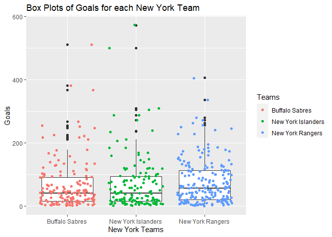
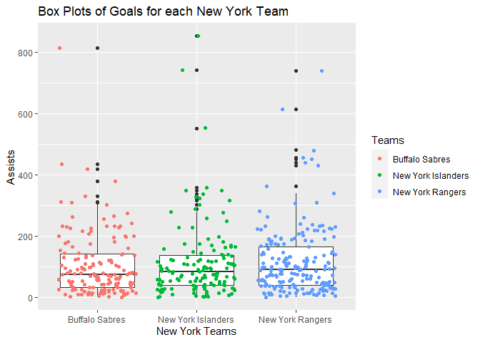

Project1
================
Vito Frank Leonardo
6/14/2021

-   [Intro](#intro)
-   [Packages Needed](#packages-needed)
-   [Accessing the API to Read the
    Data](#accessing-the-api-to-read-the-data)
    -   [Store the Base URLs](#store-the-base-urls)
    -   [Assisting Functions](#assisting-functions)
        -   [Access Data Function 1](#access-data-function-1)
        -   [Access Function 2](#access-function-2)
        -   [Return Function 1](#return-function-1)
    -   [Access Franchise Info](#access-franchise-info)
    -   [Accessing Team Totals](#accessing-team-totals)
    -   [Accessing Season Records](#accessing-season-records)
    -   [Accessing Goalie Records](#accessing-goalie-records)
    -   [Accessing Skater Records](#accessing-skater-records)
    -   [Accessing Admin History](#accessing-admin-history)
    -   [Accessing Stat Modifier](#accessing-stat-modifier)
    -   [Wrapper Function](#wrapper-function)
-   [Exploratory Data Analysis](#exploratory-data-analysis)
    -   [Comparing the Winning
        Percentages](#comparing-the-winning-percentages)
    -   [Comparing the Scoring
        Percentage](#comparing-the-scoring-percentage)
    -   [Exploring Skater Records](#exploring-skater-records)
        -   [Contingency Tables](#contingency-tables)
        -   [Numerical Summaries](#numerical-summaries)
        -   [Box Plots of Skater Data](#box-plots-of-skater-data)
        -   [The Distribution of Goals](#the-distribution-of-goals)
        -   [Relationship between Goals Per Game and Assists Per
            Game](#relationship-between-goals-per-game-and-assists-per-game)
-   [Conclusion](#conclusion)

------------------------------------------------------------------------

# Intro

This project is a vignette for reading and summarizing data from the
National Hockey League’s (NHL) API. The vignette will cover 9 functions
used to pull data from the following endpoints from the API: *General
Franchise Info*, *Team Totals*, *Team Season Records*, *Team Goalie
Records*, *Team Skater Stats*, and more. Each function will have the
ability to input the team ID numbers that the user wants to access in
vector format. If the user does not know the team ID numbers, they will
have the ability to input the names of the teams in vector format as
well. After the functions are well defined, I will demonstrate how the
functions can be used and perform a basic Exploratory Data Analysis
(EDA) using the functions.

# Packages Needed

The packages need are follows:

-   `tidyverse` for manipulating data  
-   `httr` for accessing the API  
-   `gtools` to use the `smartbind()` function when combining data  
-   `knitr` to display tables in the EDA section

Once you install these packages using `install.packages('package')`, we
will library them like below.

``` r
library(tidyverse)
library(httr)
library(gtools)
library(knitr)
```

# Accessing the API to Read the Data

## Store the Base URLs

Since we will be using the Base URL’s from the API frequently, we will
store them as variables below.

``` r
Base_URL <- "https://records.nhl.com/site/api"
Base_URL_Stats <- "https://statsapi.web.nhl.com/api/v1/teams/"
```

## Assisting Functions

Since we are going to be writing many functions accessing similar
endpoints for the APIs, we want to define some functions below that
contain code that we will use in more than 1 function.

### Access Data Function 1

Since the `Franchise Info` and `Team Totals` endpoints will access data
using similar sets of functions, we will define a wrapper function
called `AccessData1` that will return the data from the API in list
format. The function will have the following inputs: *the Base URL* and
*the endpoint or modifier*. The steps are as follows:

1.  Combine the Base URL with the endpoint using the `paste0()` function
    and store it as `Full_URL`  
2.  Use the `GET()` function from the `httr` library to retrieve the
    information from the URL and save it as `req` for request  
3.  Use the `content()` function from the `httr` library to convert the
    information into a list of data that can be accessed with R and
    return it to the user.

``` r
AccessData1 <- function(BaseURL, Endpoint){
  Full_URL <- paste0(BaseURL,Endpoint)
  req <- GET(Full_URL) 
  return(content(req)) 
}
```

### Access Function 2

For the `Season`, `Goalie`, and `Skater` endpoints, the URL’s are
structured similarly and they return similar outputs so, we can write a
function that can be used in both endpoint functions. The function
`AccessData2` functions exactly the same as `AccessData1` except the
endpoint is structured differently. The functionality is exactly the
same but since the endpoint requires the franchise ID be specified, it
is an input of the function. See below:

``` r
AccessData2 <- function(BaseURL, Type,ID){

  Endpoint <- paste0("/franchise-",Type,
                     "-records?cayenneExp=franchiseId=",ID)
  req <- GET(paste0(BaseURL,Endpoint)) 
  return( content(req) )
}  
```

### Return Function 1

This return function will take the data.frame (`df`) that we created
from the raw data list from the API and return it based on the specified
ID and Name vectors inputted by the users. We will place this function
inside our functions that we use to access the API endpoint.  
If both `ID` and `Name` are `NULL`, then the function will return the
entire data set. If not, the function will return on the teams
specified.

``` r
ReturnFun1 <- function(df, ID=NULL, Name = NULL){
    if(is.null(ID) & is.null(Name)){
    return(df)
  } else{
      NamesDf <- df %>% 
       select(id, teamCommonName) %>%
       filter(teamCommonName %in% Name)
      ID <- unique(union(ID,unlist(NamesDf$id )))
  
    return(df %>% filter(id %in% ID))
  }
}
```

## Access Franchise Info

Below is the function used to access the franchise endpoint which
Returns id, firstSeasonId and lastSeasonId and name of every team in the
history of the NHL. The steps to create the function are as follows:

1.  Use the `AccessData` function (that we previously defined) to access
    the data list and store it as `data`  
2.  Using a for loop, we will loop through each layer of the list to
    create a data frame with all of the information  
3.  Lastly, we will call the *return function* (`ReturnFun1()`)
    previously defined to return the data specified by the user.

``` r
FranchiseInfo <- function(ID=NULL, Name=NULL){
  
  data <- AccessData1(BaseURL = Base_URL, 
                      Endpoint = "/franchise")
  
  df <- data.frame(matrix(rep(0,8), nrow=1))
  colnames(df) <- names(data$data[[2]])
  for( i in 1:length(data$data)){
    datalist <- data$data[[i]]
    temp <- data.frame(matrix(datalist, nrow=1))
    df[i,] <- temp
  }
  
  ReturnFun1(df, ID, Name)

}
```

## Accessing Team Totals

Below is a function written to access an endpoint that returns Total
stats for every franchise. We will access the data as follows:

1.  Use the `AccessData` function (that we previously defined) to access
    the data list and store it as `data`  
2.  Using a for loop, we will loop through each layer of the list to
    create a data frame with all of the information  
3.  Using the previously defined API endpoint function,
    `FranchiseInfo()`, we will pull the dataset with all the team IDs
    and names then left join it will our data frame
4.  Lastly, we will call `ReturnFun1()` to return the data set with the
    ID and/or Team Names specified by the user.

``` r
TeamTotals <- function(ID=NULL, Name=NULL){

  data <- AccessData1(BaseURL = Base_URL, 
                      Endpoint =  "/franchise-team-totals")

  df <- data.frame(matrix(rep(0,length(data$data[[1]])), nrow=1))
  colnames(df) <- names(data$data[[2]])
  for( i in 1:length(data$data)){
    datalist <- data$data[[i]]
    temp <- data.frame(matrix(datalist, nrow=1))
    df[i,] <- temp
  }
  
  NamesDf <- FranchiseInfo(ID,Name) %>% 
    select(id, teamCommonName) %>%
    rename(franchiseId = id) 
  
  df <- df %>% left_join(NamesDf,"franchiseId")
  
  ReturnFun1(df, ID, Name)
}
```

## Accessing Season Records

Below is the function used to access the endpoint that returns season
records for a specific franchise. Since the endpoint requires an ID, we
have to pull the data for each franchise individually and combine them.
Since this is an exhaustive process, we will reduce the computation time
by filtering which teams we want to pull the data from before we gather
all the data instead of after like in the previous functions. The steps
are as follows:

1.  Use the `FranchiseInfo()` function to gather all of the general
    information for each team specified in the `ID` and `Name` input. We
    do this just in case the user specified only the `Name=` input or
    put a combination of `ID=` and `Name=`.  
2.  Use the previous step to create a new vector called `ID` of all the
    id’s specified by the user.  
3.  Use the `AccessData2()` function to gather the data for the first id
    specified and create a data frame with 1 row of the data.  
4.  If there was more than 1 team specified, we will repeat step 3 in a
    loop until all data for each id is gathered and combined into one
    data.frame.  
5.  Return the data.frame for the user.

``` r
SeasonRecords <- function(ID =NULL, Name = NULL){

  NamesDf <- FranchiseInfo(ID,Name) 
  ID <- unlist(NamesDf$id )
  
  Type = "season"
  data <- AccessData2(Base_URL, Type, ID[1])
  df <- data.frame(matrix(data$data[[1]],nrow = 1))
  colnames(df) <- names(data$data[[1]])
  
  if(length(ID)!=1){
    for(i in 2:length(ID)){
    data <- AccessData2(Base_URL, Type, ID[1])
    temp <- data.frame(matrix(data$data[[1]],nrow = 1))
    colnames(temp) <- names(df)
    df <- rbind(df,temp)
    }
  }

  return(df)
}
```

## Accessing Goalie Records

Below is the function used to access the endpoint that returns Goalie
records for the specified franchise. The function follows the same
structure as `SeasonRecords` except there are many layers for each ID.
Thus, it requires an extra for loop to loop through all the layers of
data. The Steps are as follows:

1.  Use the `FranchiseInfo()` function to gather all of the general
    information for each team specified in the `ID` and `Name` input. We
    do this just in case the user specified only the `Name=` input or
    put a combination of `ID=` and `Name=`.  
2.  Use the previous step to create a new vector called `ID` of all the
    id’s specified by the user.  
3.  Use the `AccessData2()` function to gather the data for the first id
    specified and create a data frame with the 1st list of the data.  
4.  Use a for loop to gather the information from the rest of the lists
    in the data set and add them to the data.frame.  
5.  If there was more than 1 team specified, we will repeat step 3 in a
    loop until all data for each id is gathered and combined into one
    data.frame.  
6.  Return the data.frame for the user.

``` r
GoalieRecords <- function(ID =NULL, Name = NULL){
  
  NamesDf <- FranchiseInfo(ID,Name) 
  ID <- unlist(NamesDf$id )
  ID <- ID[!ID == 39]
  
  Type <- "goalie"
  data <- AccessData2(Base_URL,Type,ID[1])
  df <- data.frame(matrix(data$data[[1]],nrow = 1))
  colnames(df) <- names(data$data[[1]])
  for(j in 2:length(data$data)){
    temp <- data.frame(matrix(data$data[[j]],nrow = 1))
    colnames(temp) <- colnames(df)
    df <- rbind(df,temp)
  }
  
  
  
  if(length(ID)!= 1){
    for(i in 2:length(ID)){
    data <- AccessData2(Base_URL,Type,ID[i])
      for(j in 1:length(data$data)){
      temp <- data.frame(matrix(data$data[[j]],nrow = 1))
      colnames(temp) <- colnames(df)
      df <- rbind(df,temp)
      }
    }
  }

  return(df)
}  
```

## Accessing Skater Records

Below is the function used to access the endpoint that returns Goalie
records for the specified franchise. The function follows exactly the
same staps as the previous function except the URL uses a different
`Type`. See the function below. The Steps are as follows:

1.  Use the `FranchiseInfo()` function to gather all of the general
    information for each team specified in the `ID` and `Name` input. We
    do this just in case the user specified only the `Name=` input or
    put a combination of `ID=` and `Name=`.  
2.  Use the previous step to create a new vector called `ID` of all the
    id’s specified by the user.  
3.  Use the `AccessData2()` function to gather the data for the first id
    specified and create a data frame with the 1st list of the data.  
4.  Use a for loop to gather the information from the rest of the lists
    in the data set and add them to the data.frame.  
5.  If there was more than 1 team specified, we will repeat step 3 in a
    loop until all data for each id is gathered and combined into one
    data.frame.  
6.  Return the data.frame for the user.

``` r
SkaterRecords <- function(ID =NULL, Name = NULL){

  NamesDf <- FranchiseInfo(ID,Name) 
  ID <- unlist(NamesDf$id )
  ID <- ID[!ID == 39]
  Type = "skater"

  data <- AccessData2(Base_URL,Type,ID[1])
  df <- data.frame(matrix(data$data[[1]],nrow = 1))
  colnames(df) <- names(data$data[[1]])
  for(j in 2:length(data$data)){
    temp <- data.frame(matrix(data$data[[j]],nrow = 1))
    colnames(temp) <- colnames(df)
    df <- rbind(df,temp)
  }
  
  
  
  if(length(ID)!= 1){
    for(i in 2:length(ID)){
    data <- AccessData2(Base_URL,Type,ID[i])
      for(j in 1:length(data$data)){
      temp <- data.frame(matrix(data$data[[j]],nrow = 1))
      colnames(temp) <- colnames(df)
      df <- rbind(df,temp)
      }
    }
  }

  return(df)

}
```

## Accessing Admin History

Below is the function used to access the admin history and retired
numbers. The steps are as follows:

1.  Use the `FranchiseInfo()` function to gather all of the general
    information for each team specified in the `ID` and `Name` input. We
    do this just in case the user specified only the `Name=` input or
    put a combination of `ID=` and `Name=`.  
2.  Use the previous step to create a new vector called `ID` of all the
    id’s specified by the user.  
3.  Use the `AccessData1()` function to gather the data for the first id
    specified and create a data frame with the 1st list of the data.  
4.  Use a for loop to gather the information from the rest of the lists
    in the data set and add them to the data.frame.  
5.  If there was more than 1 team specified, we will repeat step 3 in a
    loop until all data for each id is gathered and combined into one
    data.frame.  
6.  Return the data.frame for the user.

``` r
AdminRecords <- function(ID =NULL, Name = NULL){
  
  NamesDf <- FranchiseInfo(ID,Name) 
  ID <- unlist(NamesDf$id )
  ID <- ID[!ID == 39]
  df<-NULL
  
  Endpoint <- paste0("/franchise-detail?cayenneExp=mostRecentTeamId=",ID[1])
  data <- AccessData1(Base_URL, Endpoint)
  if(!is.null(unlist(data$data))){
    df <- data.frame(matrix(data$data[[1]],nrow = 1))
    colnames(df) <- names(data$data[[1]])
  }
  
  if(length(ID)!=1){
    for(i in 2:length(ID)){
    Endpoint <- paste0("/franchise-detail?cayenneExp=mostRecentTeamId=",ID[i])
    data <- AccessData1(Base_URL, Endpoint)
      if(!is.null(unlist(data$data))){
        temp <- data.frame(matrix(data$data[[1]],nrow = 1))
        colnames(temp) <- names(df)
        df <- rbind(df,temp) 
      }
    }
  }
  if(is.null(df)){
    stop("There is no data for the ID specified")
  }
  return(df)
}
```

## Accessing Stat Modifier

The below function uses the NHL stats API to access various team stats
of a single team or return data from all teams. The steps are as
follows:

1.  Use the `FranchiseInfo()` function to gather all of the general
    information for each team specified in the `ID` and `Name` input. We
    do this just in case the user specified only the `Name=` input or
    put a combination of `ID=` and `Name=`.  
2.  Use the previous step to create a new vector called `ID` of all the
    id’s specified by the user.  
3.  Pull the data from the endpoint for the the first team ID and
    convert into a data.frame.  
4.  Use a for loop to gather the information from the teams and add them
    to the data.frame created in step 3.  
5.  Filter the data.frame by the teams input by the user and found in
    step 2.  
6.  Return the data.frame for the user.

``` r
StatsExpandMod <- function(ID=NULL,Name=NULL){
  
  NamesDf <- FranchiseInfo(ID,Name) 
  ID <- unlist(NamesDf$id )
  ID <- ID[!ID == 39]
  df<-NULL
  
  Modifier <- "?expand=team.stats"
  req <- GET(paste0(Base_URL_Stats,1,Modifier)) 
  data <- content(req) 
  df <- data.frame(data$teams[[1]])
  for(i in 2:38){
    req <- GET(paste0(Base_URL_Stats,i,Modifier)) 
    data <- content(req) 
    temp <- data.frame(data$teams[[1]])
    df <- smartbind(df,temp)
    }    
  if(!is.null(ID)){
    return(df %>% filter(franchise.franchiseId %in% ID))
  } else return(df)
}
```

## Wrapper Function

Below is the code for a `Wrapper` function that will allow us to gather
data from any of the endpoints we created functions for. The `Wrapper`
function takes in the following inputs: `fun`, `ID`, and `Name`. The
`fun` input tells the wrapper function which endpoint to pull the data
from. The `ID` and `Name` are the same inputs from all of the previous
functions. We wrap all the previous functions in a switch function; this
calls the right endpoint given what was entered into `fun`.

``` r
Wrapper <- function(fun,ID=NULL,Name=NULL){
  switch(fun,
             Info = FranchiseInfo(ID,Name),
             Totals = TeamTotals(ID,Name),
             Goalie = GoalieRecords(ID,Name), 
             Season = SeasonRecords(ID,Name), 
             Skater = SkaterRecords(ID,Name), 
             Admin= AdminRecords(ID,Name), 
             TeamStat = StatsExpandMod(ID,Name),
             stop("fun must be one of the following: 
                  Info, Totals, Goalie, Season, Skater, Admin or TeamStat. 
                  fun must also be in quotation marks"))
  
}
```

# Exploratory Data Analysis

In this section, we can explore the uses of these functions by doing an
exploratory analysis of the data. Since I am originally from New York, I
will choose 3 teams from NY and do a general EDA to try to see if we can
figure out which NY team is the best.  
The NY teams are the *New York Rangers*, *New York Islanders*, and
*Buffalo Sabres*. They are defined in a vector below to be used in our
`Wrapper` function.

``` r
NY.Teams <- c("Rangers", "Islanders", "Sabres")
```

## Comparing the Winning Percentages

To compare the teams, we will start with comparing the Winning
Percentage of all 3 teams in the regular season and in the playoffs. We
will start by calling the data from the Team Totals endpoint. We will
create a variable called `WinPerc` which will be wins divided by games
played. We will also create a Season factor out of `gameTypeId` and
relabel the factors appropriately. Then, we will create a bar graph to
visually compare the Winning Percentage for each group. See the code and
output below

``` r
NY.Totals.edit <- Wrapper("Totals", Name = NY.Teams) %>%
  mutate(WinPerc = as.numeric(wins)/as.numeric(gamesPlayed),
         Season = factor(unlist(gameTypeId),
                         labels = c("Regular","Playoffs")))

ggplot(data = NY.Totals.edit, 
       mapping = aes(x=factor(unlist(teamName)), 
                     y = WinPerc, 
                     fill = Season))+
  geom_bar(stat = "identity", position = "dodge") +
  labs(title = "Historical Winning Percentages in Regular Season vs Playoffs",
       x = "New York Teams", 
       y = "Winning Percentage")
```

<!-- -->

From this bar graph, we can see that the winning percentage in the
regular season is about the same for all 3 teams but the Islanders
clearly have a better Winning Percentage in the playoffs than do the
Sabres and the Rangers.

## Comparing the Scoring Percentage

Now, we will compare the Scoring Percentage for each team. Using the
TeamStat modifier from the NHL Stats API, we will create a new variable
called `ScorePerc` which will be found by dividing the goals per game by
the shots per game. Then, we will plot it with a bar plot.

``` r
NY.TeamStat.edit <-  Wrapper("TeamStat",Name = NY.Teams) %>% 
  select(name, 
         teamStats.splits.stat.goalsPerGame, 
         teamStats.splits.stat.shotsPerGame) %>%
  rename(GoalsPerGame = teamStats.splits.stat.goalsPerGame, 
         ShotsPerGame = teamStats.splits.stat.shotsPerGame) %>%
  mutate(ScorePerc = GoalsPerGame/ShotsPerGame) %>%
  gather(key = Variable, value = value, 2:3)


ggplot(NY.TeamStat.edit, mapping = aes(x=factor(name)))+
  geom_bar(aes(y=ScorePerc/2, 
               fill = factor(name)), 
           stat = "identity")+
  labs(title = "Scoring Percentage of NY NHL Teams",
      x = "New York Teams", 
      y = "Scoring Percentage")
```

<!-- -->

From this graph, we can see that the New York Rangers have a higher
scoring percentage.

## Exploring Skater Records

Next, we will explore the Skater records to see which time has the best
Skaters.

### Contingency Tables

First, we will use the `Wrapper` function to access the Skater data for
NY teams then build a Contingency Tables.

``` r
NY.Skater <- Wrapper("Skater",  Name = NY.Teams) %>%
  mutate(Team = factor(unlist(franchiseName)),
         Active = factor(unlist(activePlayer)),
         seasons = unlist(seasons))
kable(table(NY.Skater$Team),col.names = c("Team", "Frequency"))
```

| Team               | Frequency |
|:-------------------|----------:|
| Buffalo Sabres     |       475 |
| New York Islanders |       514 |
| New York Rangers   |       995 |

Here, we can see that the Rangers have twice as many skaters in this
dataset. This may mean that the Rangers are an older team or that the
Rangers only keep there players for 1-2 seasons while the other two
teams keep their players longer.

Next, we will create another table to see if the frequency differential
is the same across active and inactive players.

``` r
kable(table(NY.Skater$Team,NY.Skater$Active), col.names = c("Inactive", "Active"))
```

|                    | Inactive | Active |
|:-------------------|---------:|-------:|
| Buffalo Sabres     |      398 |     77 |
| New York Islanders |      460 |     54 |
| New York Rangers   |      927 |     68 |

Here we can see that the Rangers have significantly more Inactive
players. Next, we will create a contingency table to see if the Rangers
have more players with less than 3 seasons. If this is so, then the team
may cycle through rookie players faster than the others.

``` r
kable(table(NY.Skater$Team,NY.Skater$seasons))
```

|                    |   1 |   2 |   3 |   4 |   5 |   6 |   7 |   8 |   9 |  10 |  11 |  12 |  13 |  14 |  15 |  16 |  17 |  18 |
|:-------------------|----:|----:|----:|----:|----:|----:|----:|----:|----:|----:|----:|----:|----:|----:|----:|----:|----:|----:|
| Buffalo Sabres     | 150 |  99 |  68 |  52 |  33 |  18 |  12 |  16 |  10 |   9 |   2 |   1 |   0 |   4 |   0 |   0 |   1 |   0 |
| New York Islanders | 206 | 109 |  60 |  39 |  23 |  25 |  13 |  14 |   8 |   6 |   2 |   4 |   2 |   1 |   2 |   0 |   0 |   0 |
| New York Rangers   | 448 | 221 | 126 |  66 |  35 |  25 |  21 |  11 |   8 |   9 |   9 |   6 |   3 |   1 |   1 |   2 |   2 |   1 |

Here we see that the Rangers do have significantly more players than
have only played 1 or 2 seasons. However, all frequecies beyond 3
seasons seem to be the same. This indicates to me that the *New York
Rangers* are an older team. After a quick google search, we can confirm
that the *Rangers* were founded in 1926 while the *Sabres* and the
*Islanders* were founded in 1970 and 1972, respectively.

### Numerical Summaries

Next, we will create Numerical Summaries of the Skater data. First, we
will find the basic summary statistics of the `GamesPlayed`, `Seasons`,
`Goals`, `Assists`, and `Points` columns for each New York team. Then,
we will create the same numerical table except for whether the skaters
are active or inactive instead of what team they are on.

#### First Group of Numerical Summaries

Below we defined a function called `NumericTable1` which will return our
desired numeric table depending on which team that we choose.

``` r
NumericTable1 <- function(team){
  NY.Skater %>% 
  filter(franchiseName == team) %>% 
  select(gamesPlayed, seasons, goals, assists, points) %>%
  rename(GamesPlayed = gamesPlayed, 
         Seasons = seasons, 
         Goals = goals, 
         Assists = assists, 
         Points = points) %>%  
  mutate(GamesPlayed = as.numeric(GamesPlayed), 
         Seasons = as.numeric(Seasons), 
         Goals = as.numeric(Goals), 
         Assists = as.numeric(Assists), 
         Points= as.numeric(Points)) %>%
  apply(MARGIN= 2,FUN = summary) %>%
  round(1) %>%
  kable(caption = paste0("Summary of Skater Stats from the ", team),
        row.names = TRUE)
}
```

Next, we will call the function for each New York team.

``` r
NumericTable1("New York Rangers")
```

|         | GamesPlayed | Seasons | Goals | Assists | Points |
|:--------|------------:|--------:|------:|--------:|-------:|
| Min.    |         1.0 |     1.0 |   0.0 |     0.0 |    0.0 |
| 1st Qu. |        12.0 |     1.0 |   0.0 |     1.0 |    2.0 |
| Median  |        46.0 |     2.0 |   3.0 |     6.0 |   11.0 |
| Mean    |       108.4 |     2.6 |  20.1 |    32.1 |   52.1 |
| 3rd Qu. |       139.0 |     3.0 |  16.0 |    30.0 |   47.0 |
| Max.    |      1160.0 |    18.0 | 406.0 |   741.0 | 1021.0 |

Summary of Skater Stats from the New York Rangers

``` r
NumericTable1('New York Islanders')
```

|         | GamesPlayed | Seasons | Goals | Assists | Points |
|:--------|------------:|--------:|------:|--------:|-------:|
| Min.    |         1.0 |     1.0 |   0.0 |     0.0 |    0.0 |
| 1st Qu. |        14.0 |     1.0 |   0.0 |     1.0 |    2.0 |
| Median  |        57.5 |     2.0 |   4.0 |     8.5 |   13.0 |
| Mean    |       130.6 |     2.9 |  23.3 |    38.6 |   61.9 |
| 3rd Qu. |       169.8 |     4.0 |  17.8 |    40.8 |   58.2 |
| Max.    |      1123.0 |    15.0 | 573.0 |   853.0 | 1353.0 |

Summary of Skater Stats from the New York Islanders

``` r
NumericTable1("Buffalo Sabres")
```

|         | GamesPlayed | Seasons | Goals | Assists | Points |
|:--------|------------:|--------:|------:|--------:|-------:|
| Min.    |         1.0 |     1.0 |   0.0 |     0.0 |      0 |
| 1st Qu. |        19.0 |     1.0 |   1.0 |     2.0 |      4 |
| Median  |        70.0 |     2.0 |   6.0 |    12.0 |     19 |
| Mean    |       146.5 |     3.2 |  26.1 |    42.9 |     69 |
| 3rd Qu. |       205.5 |     4.0 |  25.0 |    49.0 |     78 |
| Max.    |      1191.0 |    17.0 | 512.0 |   814.0 |   1326 |

Summary of Skater Stats from the Buffalo Sabres

We do not see anything interesting from these tables. The most
interesting part is that the stats tend to be generally equal across
teams.

#### Second Group of Numerical Summaries

Next, we will see if our stats differ between active and inactive
players. We will use a similar function as earlier except we replaced
the `Team` variable with the `Active` variable. The new function is
called `NumericTable2`.

``` r
NumericTable2 <- function(logical){
  NY.Skater %>% 
  filter(Active == logical) %>% 
  select(gamesPlayed, seasons, goals, assists, points) %>%
  rename(GamesPlayed = gamesPlayed, 
         Seasons = seasons, 
         Goals = goals, 
         Assists = assists, 
         Points = points) %>%  
  mutate(GamesPlayed = as.numeric(GamesPlayed), 
         Seasons = as.numeric(Seasons), 
         Goals = as.numeric(Goals), 
         Assists = as.numeric(Assists), 
         Points= as.numeric(Points)) %>%
  apply(MARGIN= 2,FUN = summary) %>%
  round(1) %>%
  kable(caption = paste0("Summary of Skater Stats where Active == ", logical),
        row.names = TRUE)
}
```

Now we will call the function for each category of the Active variable.

``` r
NumericTable2("TRUE")
```

|         | GamesPlayed | Seasons | Goals | Assists | Points |
|:--------|------------:|--------:|------:|--------:|-------:|
| Min.    |         1.0 |     1.0 |   0.0 |     0.0 |    0.0 |
| 1st Qu. |        23.5 |     1.0 |   2.0 |     2.0 |    4.0 |
| Median  |        72.0 |     2.0 |   7.0 |    13.0 |   21.0 |
| Mean    |       156.3 |     3.3 |  25.3 |    43.2 |   68.5 |
| 3rd Qu. |       243.5 |     4.0 |  31.0 |    63.5 |   98.5 |
| Max.    |       919.0 |    13.0 | 272.0 |   349.0 |  621.0 |

Summary of Skater Stats where Active == TRUE

``` r
NumericTable2("FALSE")
```

|         | GamesPlayed | Seasons | Goals | Assists | Points |
|:--------|------------:|--------:|------:|--------:|-------:|
| Min.    |         1.0 |     1.0 |     0 |     0.0 |    0.0 |
| 1st Qu. |        13.0 |     1.0 |     0 |     1.0 |    2.0 |
| Median  |        52.0 |     2.0 |     4 |     8.0 |   13.0 |
| Mean    |       119.6 |     2.8 |    22 |    35.6 |   57.6 |
| 3rd Qu. |       152.0 |     3.0 |    18 |    35.0 |   51.0 |
| Max.    |      1191.0 |    18.0 |   573 |   853.0 | 1353.0 |

Summary of Skater Stats where Active == FALSE

The Active group seems to have a higher average and median stats for all
variables. This is most likely because the Inactive group probably
contains many skaters who were not very good and were cut from the
teams.

### Box Plots of Skater Data

Now that we have an idea of the numerical summaries, we noticed that it
was hard to differentiate between teams so instead, we will try to
visualize them with Box Plots. We will focus on the two important
variables: goals and assists.

Before we do that, we will create a new data.frame with all the variable
modifications that we will need for the Box Plots. We will only use
skaters who have been on a team for more than 3 seasons because they
would be a better representation of the team. See the code and output
below.

``` r
NY.Skater.edit <- NY.Skater %>% 
  filter(seasons > 3) %>%
  mutate(Teams = factor(unlist(franchiseName)),
         activePlayer = factor(unlist(activePlayer)), 
         assists = as.numeric(assists),
         goals = as.numeric(goals), 
         gamesPlayed = as.numeric(gamesPlayed)) 

ggplot(data = NY.Skater.edit, mapping = aes(x=Teams, y=goals))+
  geom_boxplot() +
  geom_jitter(aes(color = Teams))+
  labs(title = "Box Plots of Goals for each New York Team",
       x = "New York Teams", 
       y = "Goals")
```

<!-- -->

``` r
ggplot(data = NY.Skater.edit, mapping = aes(x=Teams, y=assists))+
  geom_boxplot() +
  geom_jitter(aes(color = Teams))+
  labs(title = "Box Plots of Goals for each New York Team",
       x = "New York Teams", 
       y = "Assists")
```

<!-- -->

The Box Plots show not visual difference between Goals and Assists
between skaters on all 3 New York teams.

### The Distribution of Goals

Below we will use a histogram of the Goals variable for each team to see
if there are any distribution differences between them.

``` r
ggplot(data = NY.Skater.edit,
       mapping = aes(x=goals, fill = Team))+
  geom_histogram() +
  facet_grid(col = vars(Team))+
  labs(title = "Histogram of Goals Scored by Skaters on New York Teams", 
       x = "Number Goals by Players", 
       y = "Count")
```

<!-- -->

We see no discernable diffence in the shape of the histograms.

### Relationship between Goals Per Game and Assists Per Game

Next, we will create two new variables: `GoalsPerGame` and
`AssistsPerGame`. This is a better representation of the offensive
abilities of a player than the raw data because a player with more years
of experience cannot overshadow a more clutch skater with less years in
the game.

We want to know if players with more Goals Per Game also have more
Assists Per Game. This would indicate that offensively good players tend
to be good scorers and passers. If there is no relationship, then maybe
some players specialize in shooting goals while others focus on passing.
To visualize this, we will create a scatter plot with Goals Per Game on
the x axis and Assists Per Game on the y axis.

We also want to know if this relationship is consistent across teams or
if it differs. If it differs then the teams may have a different
coaching structure for their skaters.

``` r
NY.Skater.edit <- NY.Skater.edit %>%
  mutate(GoalsPerGame = goals/gamesPlayed,
         AssistsPerGame = assists/gamesPlayed)

ggplot(data = NY.Skater.edit, 
       mapping = aes(x=GoalsPerGame, 
                     y = AssistsPerGame, 
                     group = Team, 
                     color = Team)) +
  geom_point() +
  geom_smooth(method = lm, aes(color = Team))+
  labs(title = "The relationship between Goals and Assists Per Game",
      x = "Goals Per Game", 
      y = "Assists Per Game")
```

<!-- -->

We see a positive relationship between Goals Per Game and Assists Per
Game. However, we see no discernible difference between the trend lines.
This means that this relationship is consistent between teams.

# Conclusion

We are now done with the Exploratory Data Analysis. We have not found
any significant differences between the three New York teams but we have
learned more about NHL statistics in the process. I hope this vignette
has been helpful and you have a better understanding of how to access
the NHL API.
